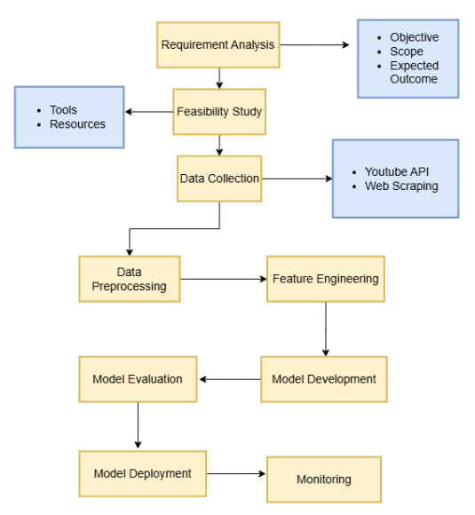

# NLP pipeline for Youtube comments sentiment analysis
 This project analyzes YouTube comment sentiment (positive, negative, neutral) to provide insights into audience feedback. The solution involves an NLP pipeline, starting with Requirement Analysis, followed by feasibility study, data collection, preprocessing, sentiment analysis, model deployment and monitoring.

 

## Requirements Analysis
 **Objective:** The goal is to classify YouTube comments into positive, negative, or neutral sentiments to analyze audience feedback.
 
 **Scope:** The analysis focuses on English-language comments from a specific video.
 
 **Expected Outcomes:** 
 
 - Each comment will be assigned a sentiment label (positive, negative, or neutral).
 - The overall sentiment of the video’s audience will be summarized (percentage of positive comments).
        
## Feasibility Study
**Data source**: Use the YouTube Data API to fetch comments from videos.

**Tools:** 
- Use NLP libraries such as Hugging Face Transformers, NLTK, or spaCy for sentiment analysis.
- Use visualization libraries like Matplotlib or Seaborn for presenting results.
- For deployment, use frameworks like FastAPI or Flask.

**Resources:** 
- For larger datasets and fine-tuning models GPU is required.
- Use cloud platforms like Google Colab for resource-heavy tasks.

## Data Collection
- Fetch comments from YouTube using an API.
- Organize data in a structured format (e.g., CSV or database) for processing.

## Data Preprocessing
- Clean comments by removing irrelevant content (e.g., URLs, emojis, special characters).
- Tokenize text into smaller components (e.g., words).

## Feature Engineering
- Convert text into numerical representations (e.g., TF-IDF) to make it suitable for machine learning models.

## Model Development
- Use a pretrained sentiment analysis model or train a custom classifier using labeled data
- Models may include Logistic Regression, LSTM, or Transformer-based architectures like BERT.

## Model Evaluation
- Evaluate the model using metrics such as accuracy, precision, recall, and F1-score on a test dataset.
## Model Deployment
- Deploy the trained model as a web API for real-time sentiment analysis.

## Monitoring 
- Monitor model performance over time using real-world data.
- Retrain the model periodically with updated comments to handle evolving language patterns.

